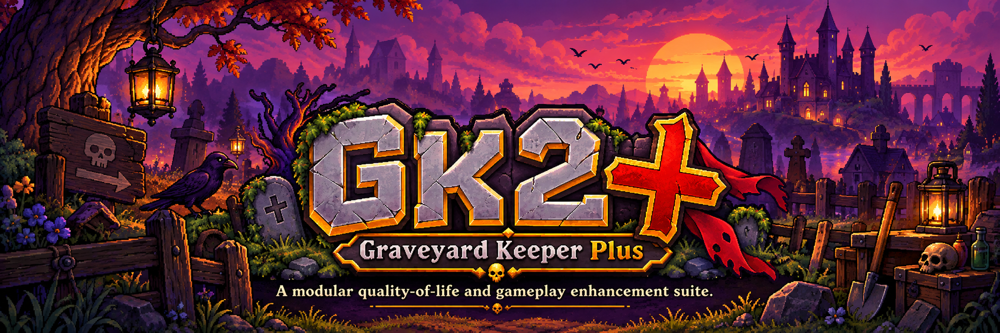

<p align="center">
  
</p>

<p align="center">
  <strong>One mod, your way.</strong><br>
  A modular quality-of-life and gameplay enhancement suite for Graveyard Keeper 2.
</p>

<p align="center">
  <a href="CHANGELOG.md">Changelog</a> •
  <a href="CONTRIBUTING.md">Contributing</a> •
  <a href="LICENSE">License</a>
</p>

<p align="center">
  
  
  
  
</p>

---

> **GK2+ v0.0.1 is an early foundation preview.**
>
> The plugin framework and native-style menu shell are working, but gameplay/QoL modules are still under development. The current F2 menu is available from the main menu and does not yet persist into active gameplay scenes.

## What is GK2+?

**GK2+ (Graveyard Keeper Plus)** is a configurable, all-in-one enhancement suite for **Graveyard Keeper 2**.

The goal is to bring quality-of-life improvements, gameplay tweaks, convenience features, optional cheats, and useful management tools into one modular mod without forcing every feature on every player.

Major systems are being built as independent modules. Where technically practical, players will be able to disable a GK2+ feature and continue using another mod's implementation instead.

### Design goals

- One primary mod instead of dozens of tiny tweaks
- Independently configurable feature modules
- Compatibility-first design
- Sensible, vanilla-friendly defaults
- Clear conflict warnings where possible
- Native-style in-game configuration UI
- Open development and community contributions
- Transparent changelogs and semantic versioning

---

## v0.0.1 Foundation Preview

The first public build establishes the base that future GK2+ features will use.

### Included

- BepInEx plugin bootstrap
- Harmony integration foundation
- Modular feature registry and feature base classes
- Master GK2+ enable/disable configuration
- Compatibility scan for loaded BepInEx plugins
- Shared framework services for:
  - events
  - saves
  - world access
  - inventory
  - crafting
  - farming
  - zombies
  - quests
  - localization
  - UI
  - diagnostics
- Native-style GK2+ badge on the Graveyard Keeper 2 main menu
- F2 GK2+ mod-menu shell on the main menu
- Esc and Close-button handling
- Category tabs for:
  - General
  - Inventory
  - Crafting
  - Farming
  - Zombies
  - Cheats
  - More
- GitHub and bug-report links from the More tab
- Public reconnaissance tooling under `tools/recon/`

### Not included yet

- Gameplay-changing QoL modules
- Cheat actions
- Persistent in-game F2 menu while actively playing
- Final feature settings/toggles inside the custom menu

These are development targets, not missing dependencies.

---

## Installation

### Requirements

- **Graveyard Keeper 2** on Windows
- **BepInEx 5.4.23.5**

### Install GK2+

1. Install BepInEx for Graveyard Keeper 2.
2. Download the GK2+ release archive.
3. Extract the archive into your **Graveyard Keeper 2** installation directory.
4. Confirm this file exists:

```text
Graveyard Keeper 2/BepInEx/plugins/GK2Plus/GK2Plus.dll
```

5. Launch the game normally.
6. On the main menu, look for the **GK2+** status badge in the upper-right corner.
7. Press **F2** from the main menu to open the current GK2+ menu shell.

### Uninstall

Delete:

```text
BepInEx/plugins/GK2Plus/
```

---

## Current UI Limitation

The v0.0.1 menu shell is currently attached to the game's main-menu UI lifecycle.

**F2 works on the main menu, but the custom menu does not yet persist after entering active gameplay.** Fixing that lifecycle is one of the next framework tasks before gameplay features are promoted into public releases.

---

## Planned Feature Areas

GK2+ is structured around several feature categories:

```text
GK2+
├── Inventory
├── Storage
├── Crafting
├── Movement
├── Farming
├── Automation
├── Economy
├── Zombies
├── Cheats
├── UI
└── Misc
```

Planned work includes features such as continuous planting, storage/crafting improvements, zombie management tools, convenience options, and optional cheat utilities. Planned items may change as the game is researched and tested.

---

## Compatibility Philosophy

GK2+ is not intended to force players into an all-or-nothing mod setup.

Where technically practical, GK2+ will:

- detect known overlapping mods,
- warn players about possible conflicts,
- allow conflicting GK2+ modules to be disabled,
- avoid touching unrelated game systems,
- use narrowly scoped Harmony patches,
- document known incompatibilities.

A feature toggle cannot guarantee compatibility with every third-party patch, but coexistence is a core project goal.

---

## Configuration

The base plugin currently exposes a master enable/disable option through BepInEx configuration.

The custom GK2+ interface is being built to eventually provide:

- category navigation,
- per-feature toggles,
- configurable values,
- compatibility notices,
- restart-required indicators,
- feature descriptions,
- optional cheat tools.

---

## Development

Repository structure:

```text
src/GK2Plus/
├── Core/
├── Features/
├── Framework/
│   ├── Crafting/
│   ├── Diagnostics/
│   ├── Events/
│   ├── Farming/
│   ├── Inventory/
│   ├── Localization/
│   ├── Quests/
│   ├── Saves/
│   ├── UI/
│   ├── World/
│   └── Zombies/
├── Patches/
├── UI/
└── Plugin.cs
```

Public reconnaissance helpers live under:

```text
tools/recon/
```

Game assemblies, decompiled source, extracted assets, private runtime reports, and local development paths are not distributed with the project.

---

## Versioning

GK2+ follows **Semantic Versioning**:

```text
MAJOR.MINOR.PATCH
```

The repository-root [`VERSION`](VERSION) file is the single source of truth.

```text
0.0.x  Foundation / early development releases
0.1.0  First meaningful gameplay/QoL release target
0.x.0  Significant feature milestones
1.0.0  Stable major release
```

See [CHANGELOG.md](CHANGELOG.md) for release history.

---

## Contributing

GK2+ is open source and community contributions are welcome.

Pull requests are reviewed for build correctness, in-game behavior, regression risk, compatibility, architecture, maintainability, licensing, and attribution.

Please read [CONTRIBUTING.md](CONTRIBUTING.md) before submitting changes.

---

## Reporting Bugs

Use GitHub Issues:

https://github.com/duhhbzz/GK2Plus/issues

Please include the GK2+ version, game version, BepInEx version, other installed mods, reproduction steps, and relevant BepInEx log output.

---

## License

See [LICENSE](LICENSE).

---

## Credits

Thanks to the Graveyard Keeper 2 modding community, the BepInEx contributors, the Harmony contributors, and everyone who tests builds, reports bugs, suggests features, or contributes code.
